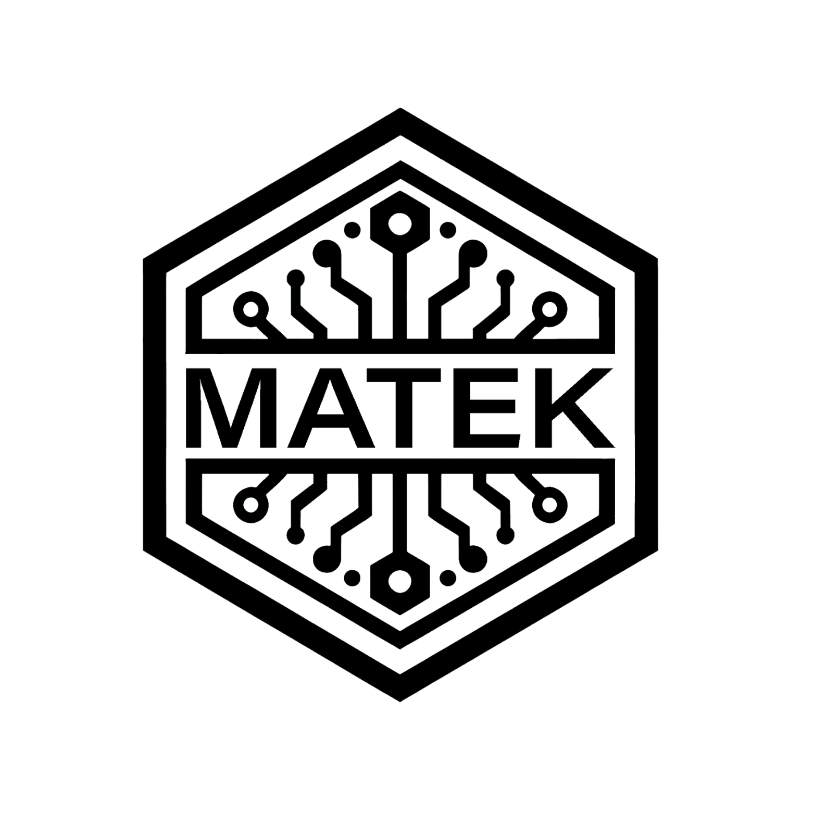

<p align="center">
  <a href="https://github.com/amar-jay/nebula">
    
    <h3 align="center">Nebula</h3>
  </a>
</p>

<p align="center">
An application system consisting of an edge server and a desktop client (built with PySide and pymavlink), communicating over ZeroMQ to control the <strong>Nebula Team's Teknofest 2025</strong> drone, featuring ArduPilot integration and planned image-based package loading.
</p>

## Demo

[](https://www.youtube.com/watch?v=ZF_N-Vu7Tik)

## Features

- **Control Station**: Built for monitoring and controlling the drone
- **Gazebo Simulation**: Gazebo and ArduPilot integration
- **Machine Learning Integration**: Object detection and monitoring with YOLO
- **GPS Coordinate Estimation**: Precise positioning and navigation
- **Controls**: Monitoring and controlling interface

## Technologies Used

- **Gazebo**: Simulation tool for robotics and autonomous systems
- **ArduPilot**: Open-source autopilot system supporting various types of vehicles
- **PySide6**: Desktop application built with PySide6 using QFluentWidget library
- **YOLO**: Object detection system for identifying and tracking objects
- **ZeroMQ**: High-performance messaging library for asynchronous communication between edge server and desktop application

## Installation

### Prerequisites

- **Operating System**: Ubuntu 22.04 or later
- **Hardware**: CUDA-enabled GPU for accelerated processing

### Setup

1. **Clone the repository** (uses Git submodules):
   ```bash
   git clone https://github.com/amar-jay/nebula.git --recursive
   ```

2. **Setup ArduPilot**:
   - Follow [ArduPilot Linux setup guide](https://ardupilot.org/dev/docs/building-setup-linux.html)
   - Follow [Gazebo and GStreamer setup guide](https://ardupilot.org/dev/docs/sitl-with-gazebo.html#sitl-with-gazebo)

3. **Install Python packages**:
   ```bash
   python3 -m venv .venv
   source .venv/bin/activate
   pip install --upgrade pip
   pip install -r requirements.txt
   ```

## Usage

### Running the Simulation

1. **Start simulation**:
   ```bash
   make run_sim
   ```

2. **Launch Control Station**:
   ```bash
   make app
   ```

3. **Launch Controls** (optional):
   ```bash
    make sim_server  # for real drone use `make server`
   ```

### Running with Real Drone

**Note**: Currently experimental - to check if it can work across herelink

```bash
make server
make app
```


## FAQs

<details>
  <summary>Gazebo Video Capture not working (Gazebo GStreamer)</summary>
  
  This application uses **GStreamer via OpenCV**. To troubleshoot:

1. Check if your OpenCV build has GStreamer support by running `make test_cv`.

2. If GStreamer is not available, the recommended approach is:

- Install GStreamer via `apt`. Follow the [Gazebo and GStreamer setup guide](https://ardupilot.org/dev/docs/sitl-with-gazebo.html#install-the-ardupilot-gazebo-plugin) 

- Rebuild [OpenCV from source](https://docs.opencv.org/4.x/d7/d9f/tutorial_linux_install.html) to ensure it picks up the GStreamer backend.

3. You can first check if camera is working perfectly first using `make gz_camera_feed`.
</details>

<details>
  <summary>In running the server, there is a warning that the queue appears to be full right after starting the server</summary>
	This is expected behavior. The server starts before the model weights are loaded, so the frame queue fills up quickly. Once the model is loaded, the queue will start to be processed and the warning will go away.

	However, if the warning persists for a long time, it may indicate that the model is not processing frames fast enough. In that case, you can try reducing the frame rate or resolution of the video feed.

	In other cases, the model isn't processing frames at all. This can be due to a number of reasons, such as:
	- The model weights are not found or not loaded correctly.
	- There is an error in the model code.
	- There is a problem with the video feed.
	- The system is overloaded and cannot keep up with the frame rate.

	These are just some of the possible reasons. You can check the server logs for more information on what might be causing the issue. You can check the logs in `~/nebula-zmq-server.log`. or start the server with `--debug` flag to enable debug logging.
</details>

<details>
<summary>How to run the server with debug logging enabled?</summary>
You can enable debug logging by adding the `--debug` flag when starting the server. For example:

```bash
	python nebula.mq.zmq_server --debug --is-simulation
```

</details>

<details>
<summary> Server not receiving drone telemetry data?</summary>
Make sure that the drone is connected to the same network as the server. If you are using a real drone, make sure that the drone is powered on and that the telemetry module is working correctly.

If you are using a simulation, make sure that the simulation is running and that the telemetry data is being sent to the correct IP address and port. You can check the telemetry settings in the ArduPilot configuration file. 

Also ensure, that gazebo camera is working correctly. You can test this by running `make gz_camera_feed` and checking if you see the camera feed. These are common issues that can cause the server to not receive telemetry data.

Usually, the issue is either with the network connection or with the camera feed. Restarting the server and the drone/simulation can also help resolve the issue.
</details>

<details>
<summary>GPS estimation works perfectly in simulation but not in the real world?</summary>

Accurate GPS-based coordinate estimation depends on several key factors, including the precision of the drone’s GPS data, proper camera calibration, and reliable object detection.  
If you’re experiencing inaccuracies in real-world tests, try the following:

- **Avoid altering the camera feed:** Ensure the live video stream isn’t being modified (e.g., by zooming, cropping, or changing resolution).  
- **Calibrate the camera:** Use tools within the `nebula/camera_calibration` directory to calibrate your camera. Accurate intrinsic parameters are crucial for precise calculations. After updating the `camera_intrinsics` within the `config/default.yaml` file. (currently the camera distortion coefficients are assumed to be zero. However, you can implement this feature if you please within the `nebula/detection/`).
- **Improve GPS accuracy:** Real-world GPS data can be affected by environmental interference—like tall buildings, trees, or reflective surfaces. Test in an open area with a clear view of the sky.  
- **Optimize camera mounting:** The camera should face directly downward (nadir orientation) and maintain a stable view of the ground. Using a gimbal for stabilization is highly recommended.
</details>

