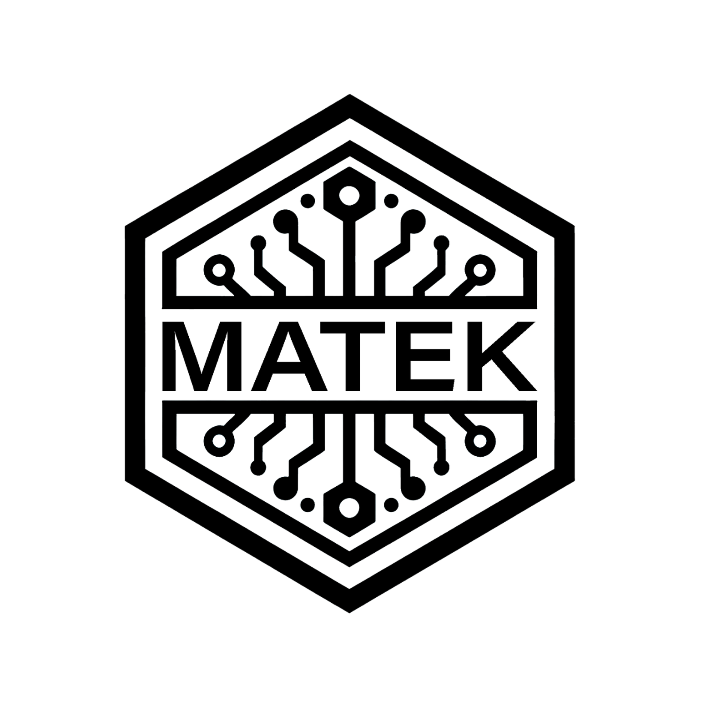

<p align="center">
  <a href="https://github.com/amar-jay/nebula">
    
    <h3 align="center">Nebula</h3>
  </a>
</p>

<p align="center">
An application system consisting of an edge server and a desktop client (built with PySide and pymavlink), communicating over ZeroMQ to control the <strong>Nebula Team's Teknofest 2025</strong> drone, featuring ArduPilot integration and planned image-based package loading.
</p>

## Demo

[](https://www.youtube.com/watch?v=ZF_N-Vu7Tik)

## Features

- **Control Station**: Built for monitoring and controlling the drone
- **Gazebo Simulation**: Gazebo and ArduPilot integration
- **Machine Learning Integration**: Object detection and monitoring with YOLO
- **GPS Coordinate Estimation**: Precise positioning and navigation
- **Controls**: Monitoring and controlling interface

## Technologies Used

- **Gazebo**: Simulation tool for robotics and autonomous systems
- **ArduPilot**: Open-source autopilot system supporting various types of vehicles
- **PySide6**: Desktop application built with PySide6 using QFluentWidget library
- **YOLO**: Object detection system for identifying and tracking objects
- **ZeroMQ**: High-performance messaging library for asynchronous communication between edge server and desktop application

## Installation

### Prerequisites

- **Operating System**: Ubuntu 22.04 or later
- **Hardware**: CUDA-enabled GPU for accelerated processing

### Setup

1. **Clone the repository** (uses Git submodules):
   ```bash
   git clone --recurse-submodules https://github.com/amar-jay/nebula.git
   cd nebula
   git submodule update --remote --merge
   git submodule update --init --recursive
   ```

2. **Setup ArduPilot**:
   - Follow [ArduPilot Linux setup guide](https://ardupilot.org/dev/docs/building-setup-linux.html)
   - Follow [Gazebo and GStreamer setup guide](https://ardupilot.org/dev/docs/sitl-with-gazebo.html#sitl-with-gazebo)

3. **Install Python packages**:
   ```bash
   python3 -m venv .venv
   source .venv/bin/activate
   pip install --upgrade pip
   pip install -r requirements.txt
   ```

## Usage

### Running the Simulation

1. **Start simulation**:
   ```bash
   make run_sim
   ```

2. **Launch Control Station**:
   ```bash
   make app
   ```

3. **Launch Controls** (optional):
   ```bash
    make sim_server  # for real drone use `make server`
   ```

### Running with Real Drone

**Note**: Currently experimental - to check if it can work across herelink

```bash
make server
make app
```
