# Communication Architecture


## History

Designing a reliable communication channel between the drone (equipped with an onboard edge computer - Orin Nano) and the ground control station proved to be one of the most critical—and initially frustrating—challenges in the development of the **Nebula 2025** for Teknofest 2025

### Why Not ROS?

At first glance, the natural choice for robotics communication might seem to be [ROS](https://www.ros.org/) or [ROS2](https://docs.ros.org/en/rolling/index.html), especially considering their ecosystem of message passing, visualization, tools, and standardized messaging protocols. But we made a deliberate decision not to use either.

The main issue stems from ROS being heavily integrated into its own walled ecosystem. Tools like Cartographer, RViz, or rosbag are fantastic within that environment, but poorly maintained outside it. Many open-source packages built for ROS1 are incompatible with newer Python or system libraries, frequently breaking due to outdated dependencies or missing import paths. On top of this, creating custom, ROS-independent bridges for control systems or vision pipelines was a maintenance nightmare—especially with time constraints.

ROS2, while more modern, introduced additional complexity. It no longer uses TCP or UDP sockets directly but instead builds on **DDS** (Data Distribution Service)—a much heavier, enterprise-level transport layer that we had no intention of debugging or optimizing. Given our tight development cycles and the embedded nature of our project, we needed something leaner, faster to implement, and easier to reason about.

### Our Alternative: ZeroMQ

Instead of relying on ROS, we developed our own message-passing architecture, building it from the ground up in **Python**, using [ZeroMQ (ZMQ)](https://zeromq.org/) as our communication backbone.

ZMQ proved to be a perfect fit: lightweight, flexible, and highly intuitive once you understand its socket types. It abstracts away the messiness of raw sockets and provides robust patterns for distributed systems: **Push/Pull**, **Request/Reply**, and the one we eventually settled on—**Publisher/Subscriber**.

Our first experiment used the Push-Pull pattern, which worked in theory given the single-producer/single-consumer relationship between ground station and drone. But in practice, it was brittle. The pull side could block or desynchronize if messages came too fast or if one side rebooted. We switched to the **Pub-Sub** model, which offered better decoupling, built-in topic filtering, and resilience to restarts. Inspired by the canonical examples in [The ZeroMQ Guide](https://zguide.zeromq.org/docs/chapter1/), we implemented our own topic-based channels for video frames, command messages, and telemetry.



### Message Format

We kept things simple. No protobufs. No custom serializers. All messages are passed as UTF-8 encoded strings. On the subscriber end, we parse them using Python’s built-in split on delimiters where appropriate. This gave us the flexibility to iterate quickly without locking ourselves into a rigid schema.

### Server Concurrency Evolution

On the edge server (onboard the drone), the earliest version of our system used traditional Python threads for concurrency—handling each message channel or sensor stream in a separate thread. While this worked, it quickly became hard to manage and prone to subtle bugs, especially during shutdowns or when certain sockets dropped out.

Eventually, after diving deeper into **asyncio**, and with some help from ChatGPT 😄, we ported the server to an asynchronous model. Surprisingly, we didn’t get massive performance gains—but what we did get was **clarity**. The code became dramatically easier to read and maintain. With coroutines managing message queues and periodic loops, we had much finer control over CPU scheduling and state transitions. This new structure also made it easy to isolate CPU-heavy tasks like image processing into a `ThreadPoolExecutor`, preventing the event loop from being blocked—an issue that previously caused frequent stutters.

### Client-Side: PySide and QThreads

On the client side (i.e., ground station), the application is built with **PySide** (Qt for Python), which introduces its own threading model. Initially, we used plain Python threads to receive and decode video streams, but this clashed with the Qt event loop and caused UI freezes or race conditions.

To solve this, we moved our ZMQ client into a `QThread` subclass, which could safely emit signals to the main GUI thread. Video frames from the drone are received over a ZMQ subscriber socket, decoded with OpenCV, and dispatched through Qt signals to the main UI. Each incoming message is categorized based on topic: raw video, processed video, telemetry, etc.

Below is an excerpt from the actual implementation within the `ZMQClient`:

```python
class ZMQVideoThread(QThread):
    def run(self):
        while self.running:
            try:
                if self.video_socket.poll(timeout=100) != 0:
                    topic, frame_data = self.video_socket.recv_multipart()

                    jpg_buffer = np.frombuffer(frame_data, dtype=np.uint8)
                    frame = cv2.imdecode(jpg_buffer, cv2.IMREAD_COLOR)

                    if frame is not None:
                        if topic == b"processed_video":
                            self.processed_frame_received.emit(frame)
                        elif topic == b"video":
                            self.frame_received.emit(frame)
            except Exception:
                ...
```

This architecture has been reliable during flights, supporting both control commands and high-bandwidth video streaming without dropped frames or lockups.


---

### Summary

- **Transport Layer**: [ZeroMQ](https://zeromq.org/), **Pub-Sub** model
    
- **Server (Edge Computer)**: `asyncio` for all concurrency; uses `ThreadPoolExecutor` for image processing
    
- **Client (Ground Station)**: `QThread` for ZMQ socket handling, connected to GUI via PySide signals
    
- **Message Format**: Strings and JSON
    

---

## General Communication Architecture

The following diagram illustrates the high-level structure of the Nebula Drone's communication system. It emphasizes how concurrency and asynchronicity are handled on both the drone's edge server and the GUI client.



---

## Asynchronous Frame Processing

Our **`AsyncFrameProcessor`** ensures that object detection never interrupts the live video stream. When we call `start()`, it spins up a daemon worker thread that watches a small input queue. Each incoming `FrameData` is submitted to a `ThreadPoolExecutor` (we default to 2 threads/workers), and must complete within 500 ms to maintain responsiveness. Once processed, results enter a second queue; if that fills, we discard the oldest result so only fresh frames propagate.

Within `_process_frame`, we:

1. Invoke our YOLO tracker to detect and localize objects in world coordinates.    
2. Overlay annotations via `write_on_frame`, gracefully falling back to the original frame if any errors occur

Our `submit_frame()` method drops frames when the input queue is full, avoiding unbounded memory growth. Meanwhile, `get_result()` lets the video loop fetch the latest `ProcessedResult` without blocking.

---

## MAVLink Proxy—Bridging Serial and TCP

The **`MAVLinkProxy`** class hides the complexity of talking MAVLink over serial or UDP while sharing that stream with multiple TCP clients. Upon `start()`, we:

- Instantiate `ArdupilotConnection` (choosing between `/dev/ttyUSB0` for hardware or `udp:` for simulation).
    
- Launch a TCP server socket on our chosen port.
    
- Spawn one thread to accept client connections—each in its own handler thread that forwards incoming bytes into the MAVLink master—and another thread that reads MAVLink messages and broadcasts them back out to all connected clients.
    

Our `get_drone_data()` method packages GPS, attitude, ground level, and flight mode into a single tuple. On any failure, we log a warning and return `None`, letting the caller skip optional processing rather than crash.

When we call `stop()`, we cleanly shut down the server socket, all client sockets, and the underlying MAVLink connection, ensuring no stray threads or sockets linger.

---

## ZMQServer—Publishing Video and Command Handling

Our **`ZMQServer`** orchestrates two concurrent loops over ZeroMQ: one publishing raw and processed video frames on a PUB socket, the other replying to control commands on a REP socket.

### Initialization & Tracker Setup

In the constructor, we record ports, video source, and whether we’re in simulation. We immediately call `_initialize_tracker()` where we:

- Fetch camera intrinsics (either from Gazebo or our mission definitions).
    
- Instantiate `YoloObjectTracker` with those intrinsics and our trained model.
    
- Create an `AsyncFrameProcessor` to offload detection work.
    

If any of these steps fail, we raise an exception to avoid running with a broken tracker.

### Video Capture & Encoding

Before streaming, `_initialize_video_capture()` attempts to open either the Gazebo feed or a live camera device. Failure yields a logged error and aborts the loop.

In `_encode_frame()`, we compress each frame to JPEG using OpenCV. While we acknowledge it’s not the most efficient codec, JPEG integrates directly with `QImage` on the client side and was the right trade‑off under our time constraints.

### The Publisher Loop

Our `async` `_video_publisher_loop` performs the following each iteration:

1. Read a frame from the capture source.
    
2. Immediately publish the raw frame via `video_socket.send_multipart`.
    
3. Every third frame, fetch the latest drone data from `MAVLinkProxy` and wrap it in `FrameData`.
    
4. Submit that frame to our `AsyncFrameProcessor`. If its queue is full, we log and drop.
    
5. Poll `results_queue` for any `ProcessedResult`. If found, update our internal GPS/pixel caches and publish the processed frame under `"processed_"`.
    
6. Every five seconds, log our FPS to help us monitor performance.
    
7. Sleep briefly (`await asyncio.sleep(0.5)`) to avoid pegging the CPU.
    

If the capture device ever fails, we log and retry after a short pause. On exit, we release the capture and log that publishing has stopped.

### The Control Loop

Concurrently, `_control_receiver_loop` listens for command strings on our REP socket. When a message arrives, we strip and compare against known topics:

- **Load/Hook commands** update an internal `hook_state`, ACK or NACK based on idempotence.
    
- **STATUS** returns the current hook state.
    
- **HELIPAD_GPS** and **TANK_GPS** reply with the latest coordinates if we have them.
    

Each successful command is logged; unknown commands elicit a “NACK: Unknown command.”

### Lifecycle Management

When `start()` is called, we bind our PUB and REP sockets, start the frame processor, set `running = True`, and launch both loops via `asyncio.gather`. A subsequent `stop()` clears the flag, halts the processor, closes sockets, and terminates the ZeroMQ context.

This is the complete lifecycle management of this server, ensuring it can be cleanly started and stopped without leaving dangling threads or sockets.

